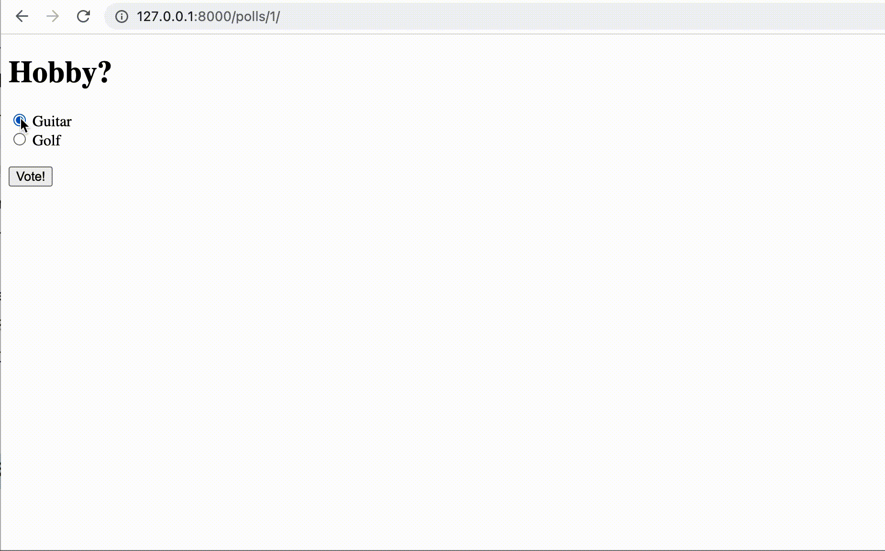

# Poll App

### 📝 Description 

**You can conduct a poll and see the result**

**[Function]**

* Carry out a poll
* See the result page and redo the poll

  

### How to run this app?

👉🏼 **Type the code below at your Terminal**

```Bash
# Go to directory where this file saved
$ python manage.py runserver
```


## Demo Website

